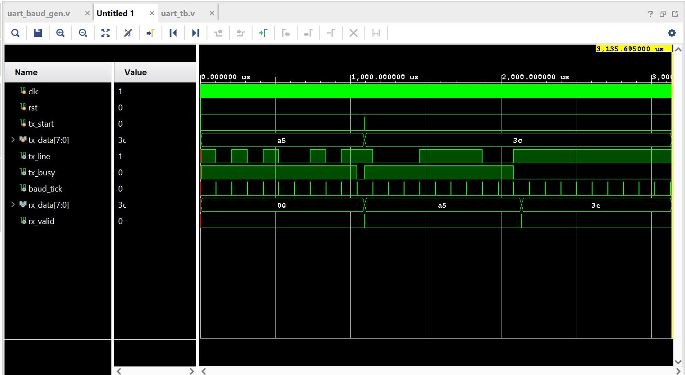
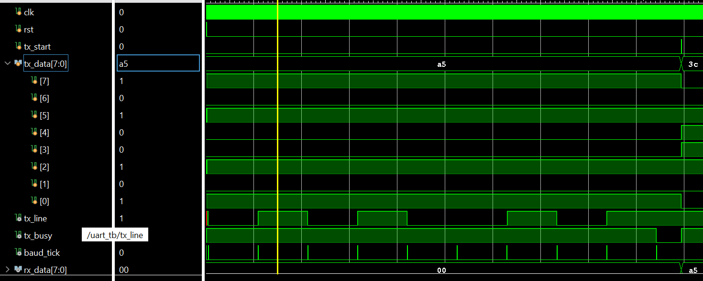
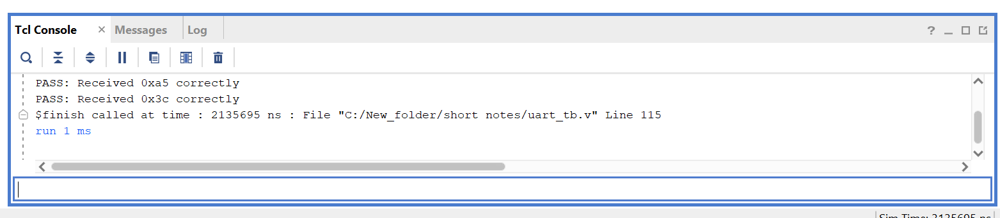

# UART Controller — Verilog Implementation

A fully functional UART (Universal Asynchronous Receiver-Transmitter) controller implemented in Verilog, designed and verified using Xilinx Vivado. The design follows the standard **8N1 frame format** at **9600 baud** with a **100 MHz system clock**.

---

## Overview

UART is a point-to-point asynchronous serial communication protocol widely used in embedded systems, FPGAs, and SoC designs. This project implements the complete UART datapath including a baud rate generator, a transmitter FSM, and a receiver FSM with mid-bit sampling — verified through a loopback testbench.

---

## Architecture

The design is split into three independent modules:

### 1. Baud Rate Generator (`uart_baud_gen.v`)
Generates a single-cycle `baud_tick` pulse at the correct bit period interval.

**Calculation:**
```
Clocks per bit = System Clock / Baud Rate
               = 100,000,000 / 9600
               = 10,416 cycles
```

A 14-bit counter counts up to 10,415 and resets, producing a pulse every bit period.

---

### 2. UART Transmitter (`uart_tx.v`)
A 4-state FSM that shifts out a byte serially on the `tx` line, LSB first.

| State | Action |
|-------|--------|
| IDLE  | Line held HIGH, waits for `tx_start` pulse |
| START | Pulls line LOW for one bit period (start bit) |
| DATA  | Shifts out 8 data bits on each `baud_tick` |
| STOP  | Pulls line HIGH for one bit period (stop bit) |

---

### 3. UART Receiver (`uart_rx.v`)
A 4-state FSM that detects the start bit, samples each data bit at the **middle of the bit period** to avoid edge noise, and assembles the received byte.

| State | Action |
|-------|--------|
| IDLE  | Waits for falling edge on `rx` line (start bit) |
| START | Waits for HALF_BIT (5208 cycles) to reach mid-bit, validates start |
| DATA  | Samples `rx` every 10,416 cycles, assembles 8 bits |
| STOP  | Waits for stop bit, asserts `rx_valid` with received byte |

**Mid-bit sampling:**
```
Half bit period = 10,416 / 2 = 5,208 cycles
```
Sampling at the center of each bit period ensures maximum noise margin.

---

## UART Frame Format (8N1)

```
Idle  Start  D0  D1  D2  D3  D4  D5  D6  D7  Stop  Idle
HIGH   LOW   ——————— 8 Data Bits ———————  HIGH  HIGH
```

Total frame = **10 bits** per byte transmitted.

---

## Simulation & Verification

The testbench (`uart_tb.v`) connects the TX output directly to the RX input (loopback configuration) and transmits two bytes — `0xA5` and `0x3C` — verifying correct reception of both.

### Waveform — Full Transmission (3ms view)
Shows both byte transmissions, `baud_tick` pulses, `tx_busy` signal, and `rx_valid` assertion.



---

### Waveform — TX Bit Pattern (Zoomed)
Zoomed view of `tx_line` showing the start bit, 8 data bits of `0xA5` (10100101), and stop bit clearly visible.



---

### Simulation Console Output
Functional verification output from Vivado TCL console confirming correct reception of both transmitted bytes.



---

## How to Simulate in Vivado

1. Create a new **RTL Project** in Vivado (no sources at creation)
2. Add all `.v` files from `src/` and `tb/` as sources
3. Set `uart_tb` as the **top module** for simulation
4. Click **Run Simulation → Run Behavioral Simulation**
5. In the simulation toolbar set run time to `3ms` and click **Run**
6. Click **Zoom Fit** to view the full waveform
7. Add signals: `clk`, `rst`, `tx_start`, `tx_data`, `tx_line`, `tx_busy`, `baud_tick`, `rx_data`, `rx_valid`

---

## Parameters

| Parameter | Value |
|-----------|-------|
| System Clock | 100 MHz |
| Baud Rate | 9600 |
| Data Bits | 8 |
| Parity | None |
| Stop Bits | 1 |
| Frame Format | 8N1 |
| Clocks per Bit | 10,416 |

---

## Tools Used

- **Xilinx Vivado** — Simulation and waveform analysis
- **Verilog HDL** — RTL design
- **Behavioral Simulation** — Functional verification

---

## Author

**Harshith-Pulla**  
[GitHub](https://github.com/Harshith-Pulla)

---

## License

This project is licensed under the MIT License. See the [LICENSE](LICENSE) file for details.
